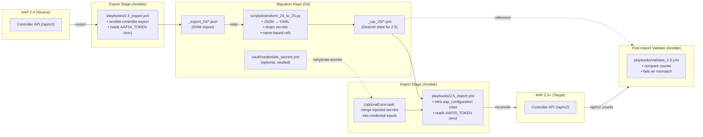
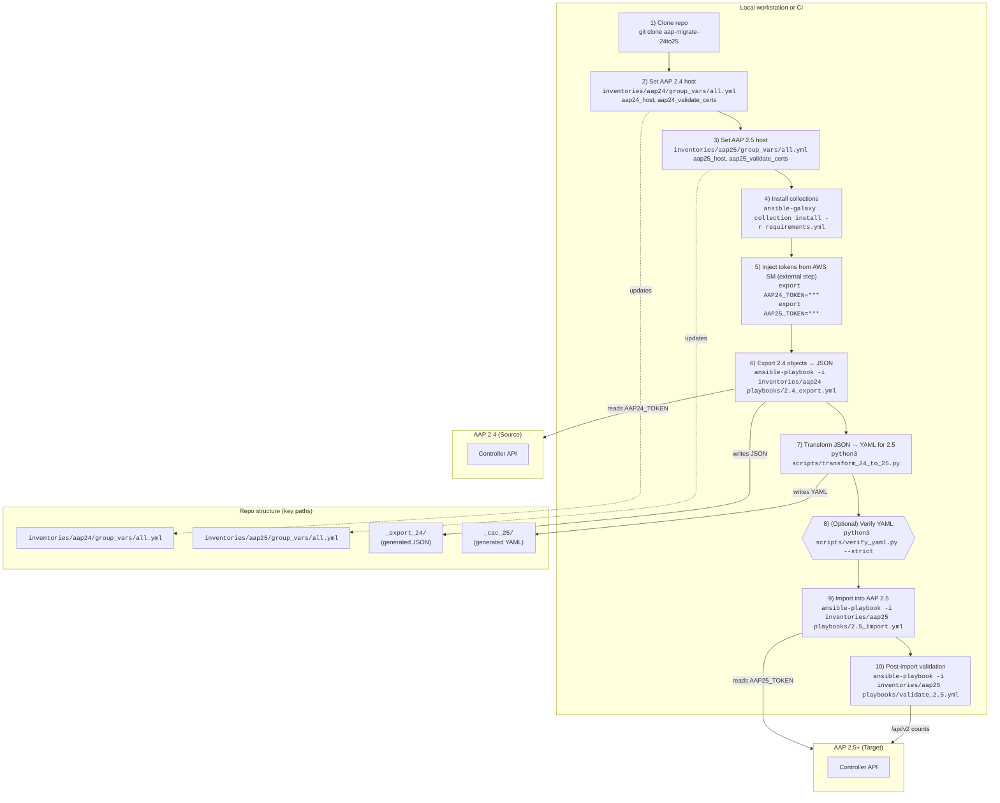

# AAP 2.4 ➜ 2.5 Migration Config-as-Code, Zero-Touch

## Purpose

This repository automates a **fully unattended** migration from **AAP 2.4** to **AAP 2.5+** using the Red Hat Configuration-as-Code (CaC) collections:

- **Export** all objects from AAP 2.4 programmatically.
- **Transform** JSON --> YAML to match AAP 2.5 CaC schemas.
- **Import** into a clean AAP 2.5 using `infra.aap_configuration`.

Secrets are **NOT** embedded in exports. They are re-hydrated during import via the Ally secrets source AWS Secrets Manager --> CI env vars --> Ansible vars.

---

## Directory Structure

```
├── Makefile
├── README.md
├── _cac_25
│   ├── controller_credentials.yml
│   ├── controller_execution_environments.yml
│   ├── controller_inventories.yml
│   ├── controller_organizations.yml
│   ├── controller_projects.yml
│   ├── controller_templates.yml
│   └── controller_workflows.yml
├── _export_24
├── ansible.cfg
├── ci
│   └── pipeline.yml
├── collections
│   └── requirements.yml
├── inventories
│   ├── aap24
│   │   └── group_vars
│   │       └── all.yml # AAP 2.4 Host Connection
│   └── aap25
│       └── group_vars
│           └── all.yml # AAP 2.5 Host Connection
├── playbooks
│   ├── 2.4_export.yml
│   ├── 2.5_import.yml
│   ├── preflight.yml
│   └── validate_2.5.yml
├── pyproject.toml
├── scripts
│   ├── transform_24_to_25.py
│   └── verify_yaml.py
├── vars
│   ├── collections-constraints.yml
│   └── dispatch.yml
└── vault
    └── credentials_secrets.yml
```

## File Details
- **requirements.yml** — Ansible Galaxy collections needed for export/import.
- **Makefile** — convenience targets --> `galaxy`, `export`, `transform`, `import`.
- **inventories/** — controller connection settings for AAP 2.4 and 2.5.
- **playbooks/2.4_export.yml** — exports orgs, credentials, projects, inventories, templates, execution environments, and workflows to JSON.
- **scripts/transform_24_to_25.py** — converts JSON exports into YAML variables expected by `infra.aap_configuration`.
- **playbooks/2.5_import.yml** — applies YAML into AAP 2.5 using CaC roles.
- **playbooks/validate_2.5.yml** — compares exported counts vs. live AAP 2.5 counts and fails on mismatch.
- **scripts/verify_yaml.py** — lints/parses `_cac_25/*.yml` and does lightweight schema checks.
- **vault/credentials_secrets.yml** — (optional) Ansible-Vault file to rehydrate credential inputs by `(Org:/ CredentialName)` mapping.
- **.gitlab-ci.yml** — GitLab pipeline export --> transform --> import consuming injected secrets.
- **.env.example** — optional local dev template for env vars.

---

## Requirements

- **Python** 3.9+
- **Ansible** 2.15+ (CLI)
- **Collections** installed via `requirements.yml`:
  - `ansible.controller` (export)
  - `infra.aap_configuration` (import)
- **Network access** to AAP 2.4 & AAP 2.5 APIs.
- **Credentials injected via AWS Secrets Manager**:
  - `AAP24_TOKEN` read across all orgs — used by **export**.
  - `AAP25_TOKEN` admin/write — used by **import** and **validate**.

> Retrieval from AWS SM is **external** to this repo. Ensure the CI sets these env vars before running Ansible/Python.

---

## Installation

```bash
# from repo root
ansible-galaxy collection install -r requirements.yml
```

## Export from AAP 2.4
1.  Set the Ally AAP 2.4 URL in the inventoryies/aap24/group_vars/all.yml
```
export AAP24_TOKEN=*****     # injected by AWS SM
ansible-playbook -i inventories/aap24 playbooks/2.4_export.yml
# JSON appears in _export_24/
```

2.  Transform JSON to YAML
```
python3 scripts/transform_24_to_25.py
# YAML appears in _cac_25/
```
3.  Set AAP 2.5 URL in inventoryies/aap25/group_vars/all.yml
```
export AAP25_TOKEN=*****     # injected by AWS SM
ansible-playbook -i inventories/aap25 playbooks/2.5_import.yml
```
4.  Validation: The validator compares object counts orgs, projects, inventories, credentials, job templates, workflow job templates, execution environments between _export_24 and live AAP 2.5. It fails the run if mismatches are found.
```
export AAP25_TOKEN=*****
ansible-playbook -i inventories/aap25 playbooks/validate_2.5.yml
```

## How to Exclude Resources During Export
To exclude resources from the export play we will need to modify the playbooks/2.4_export.yml and remove items from export_objects:
```
export_objects:
  - organizations
  - users
  # - teams                 # comment to exclude
  - credential_types
  - credentials
  - projects
  - inventories
  - execution_environments
  - job_templates
  - workflow_job_templates
  - applications
  - notification_templates
  - schedules
```

## How to Exclude Resources During Import 
To exclude resources during the import play we will need to modify playbooks/2.5_import.yml, or we can set the corresponding var to [] --> controller_projects: [] to no-op the role to exclude.
```
- import_role: { name: controller_organizations }
# - import_role: { name: controller_execution_environments }  # skip EEs
- import_role: { name: controller_projects }
...
```

## Secret Injection
- NOTE: This repo intentionally does **NOT** fetch secrets; it expects them to be present as env vars or written to files by an Ally pipeline step. 
Ally has a set of pipeline templates that confidentially pull secrets from AWS SM. These are then injected into the pipeline. 
- playbooks/2.4_export.yml reads: controller_oauthtoken: "{{ lookup('env','AAP24_TOKEN') }}"
- playbooks/2.5_import.yml and playbooks/validate_2.5.yml read: controller_oauthtoken: "{{ lookup('env','AAP25_TOKEN') }}"
- Credential inputs remain out of exported YAML. Optionally:
  - Place a vaulted map in vault/credentials_secrets.yml keyed by "OrgName:/ Credential Name".
  - Add a short pre-task in the import play to merge those values into each credential’s inputs.
  - Or inject env vars from CI and merge them.


## Data Flow Diagram



## How To Get Started Diagram

